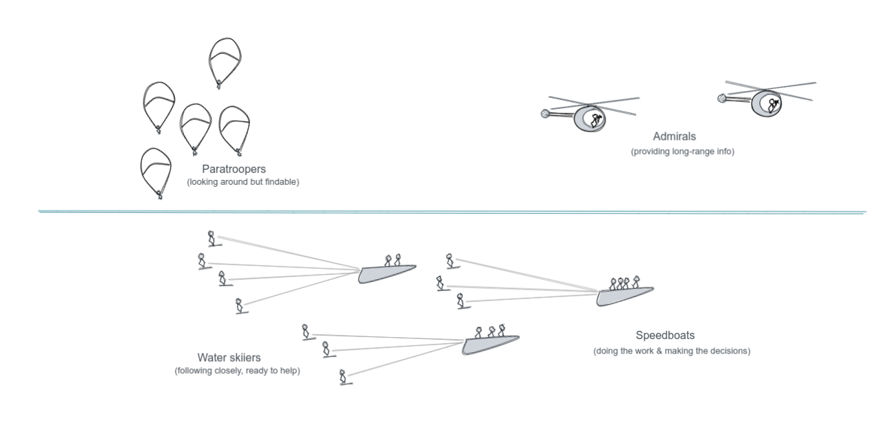

# Decentralised Agile

Source Institute collaborations usually run using a form of [Agile](https://www.gov.uk/service-manual/agile-delivery/agile-tools-techniques) and Lean methodologies, and a calm, [async-first communication culture](../remote/).

There are significant differences though:

- The org structure is very decentralised, enabling us to act as a swarm or independently as needed.
- Our squads are far more independent, choosing their own goals and tools.
- Our strategy is more emergent, and more informed by the front-line.  Squad captains contribute to strategy.

We call our approach the Speedboat Armada. Each squad is like a speedboat, with waterskiiers in tow. Each is self-directed, but coordinates with the others.

## Source OS

The Source Operation System is our way of working, defined as a few simple practices.

The idea with an "Operating System" with versions is to give everyone a clear sense of how things work, and we can step change with less confusion, rather than slowly shifting and trying to catch people up. Like an OS for your computer let's you focus on your work without needing to worry about how the computer works, Source OS is designed to allow you to focus on your work with almost no effort put towards management and coordination. (Coordination becomes a by-product of doing the real work.)

The priority is to achieve connection and growth with our communities through the various products we have. Each product has a constituent user group: Leancamp, Deep Dive, Mentor Impact, Partnership Design, Decision Hacks, Source Summit, Brain Trust etc. The priority is to get Captains to (wo)man the boats, and to take initiatives in new squards to explore new ways to enable peer learning communities.

!!! success "Source OS is designed for"

    === "Initiative"
        Source OS is designed to allow us to take initiatives of our own.  If you have an idea, get it going yourself or start a speedboat.  You're the captain of your own ship within the Source armada, and we coordinate at the Armada meeting every 2 months.

        So basically, we're aiming for more, smaller, self-directed teams that align themselves quarterly.

    === "Permeability"
        We've learned a lot from a the Lean and Agile community, but a key difference we found was that Source is very permeable and work with us is far more ephemeral and temporary.

        We work with such a large variety of clients, cultures and very often with one-time volunteers.  This means the learning curve of Agile is just too much. 

        So over time, Source OS has adapted to become lighter and easier for new people to get involved and hit the ground running.

    === "Wayfinding"
        The intention here is to step away from the problems caused by the lack of structure we've had previously, where we would wait for an initiative to get started by someone else, and then everyone would jump on it at once.  This created a lot of needless complication, confusion and extra work for the initiators, and overloaded projects too early, just as they were getting momentum.  Ultimately, creating organisational weakness at sales, communication and in delivering projects.

        So with Source OS, taking unilateral initiative on a project you lead is encouraged, and where you're not the squad leader or on the core team (on the speedboat), then you're expected to make yourself available to be delegated to.

    === "Surplus time"
        Urgency/busyness seems to be a constant everywhere. Although busyness hurts the business, it’s fiercely contagious since the infected (aka busy people) are visibly suffering and thus seem to have the moral high-ground. Without active opposite pressure, their long hours and off-handed comments (“well, back to the old grindstone”, “you guys go on home, I’m going to get a little more done”) will eventually swing the team. 
     
        The biggest problem with this is that the people who can't manage their time well are always making themselves and others busy with busywork (meetings, impractical documentation, etc.) and fundamentally not getting results.  As the team gravitates into their meeting blackhole, nobody gets results.

        Creating surplus time individually creates a new gravity well towards calm work that gets better results.  Why?  When you have surplus time, you make yourself available to act on the best opportunities, and act with the calmness and sure-footedness of someonw fresh and well-rested. With a busy schedule, there's no room to maneuvre and no gas left in the tank when you need it.

        So Source OS is designed to free everyone from meetings and busywork so we can all focus on real work, and be ready when needed to get the big results.

    === "Personal development"
        Self-improvement and peer-support go hand in hand. This started on Day 1 on the beach in Gradina, and it's part of Source culture I really want to defend and grow.

        There is a skill-set part of personal development, relating to what we consider to be quality entrepreneurship education, and the role of the facilitator/curator there.

        There is also a creation part of personal development. Source is a resource you can employ to create great new things. What will you use Source for to make, and deliver on what the world needs?

## The Speedboat Armada Model

We are not a hierarchical company, we are an armada of speedboats, Mad Max style! 

Imagine an armada of speedboats, with waterskiiers in tow.

Each project has **decentralised leadership**, the crew themeselves, driving the speedboat. They take responsibility for leading, organising, and they make the decisions. They drive the boat, and also do all the main work. These on-boat teams stay small like startup founding teams so they can remain quick.

If you're not in the crew (on the boat), you can be a waterskiier (on a rope). This  means you're willing to help, and to be pulled in. You follow the project's updates, and are responsive on internal communications.  This could be part of the delivery, or it can be an offer to advise, take calls, etc.

!!! tip "Terminology"

    We use "On Boat" (core to delivery, making decisions) and "On Rope" (watching, ready and able to be delegated specific responsibilities) as shortcuts to set expectations on commitment and communication.  You'll hear things like "I'm on rope on Erasmus+" meaning they're following that project and have made their availabilit to happy clear.  

#### Small, self-organising teams

With smaller core teams, we're more efficient and quicker to jump on opportunities.  Also, we get better at building momentum since our energy goes into growth and impact, rather than management and coordination. 

This also creates incentive for everyone to take the lead on to try something new, and build a small agile team to do it, building lots of powerful engines to pull us.  That's way more effective than pooling a lot of resources into a single team with a lot of different objectives to manage.  

!!! warning "Speedboats are probably different than what you're used to"

    === "Products, not projects"

        Speedboats deliver user-focused products.  They are not defined by general work (projects) but outputs that deliver specific value to specific groups of people (products).  Speedboats are agile Squads, multi-disciplinary teams that deliver value to the user at the end of every one or two-week sprint.

        Projects have goals that serve the host organisation.  Products have goals that serve the user.  When you organise into product teams, you break work down, not by function, but by value to the end-user.  

    === "User Stories, not tasks"

        A specific Agile technique called User Stories is the unit of progress.  Shipping something that achieves the user stories allows the squad to self-organise and do what needs doing to deliver value, rather than require a manager to chase tasks.

        https://www.youtube.com/watch?v=LGeDZmrWwsw

    === "Internally functional"

        Speedboats have every function they need on their squad.

        When you break up your teams by function, then you create interdependency.  This slows us down because each squad is going to end up waiting on others. This leads to more need for planning and management overhead, and less time for doing.  It also leads to feeling like you *shouldn't do what makes sense for you* because it might mess with another project.  

        Product teams have everyone they need in the squad and can act.  The squad doesn't need to check in with anyone but themselves for operational issues.  (Only the Captain needs to update OKRs every 2 months and confidence levels every month.).  There's less time needed for meetings and talking, and more of a culture of "let's just try this and let the results speak for themselves."

    === "Results-oriented"

        Speedboats hold themselves accountable to results.

        The Product Owner sets success metrics and the team then implements a way to track them.  Each sprint, the team reviews their work against performance, and learns and adapts accordingly.  As a self-directing team, the squad members don't wait for management to check the metrics and suggest course-corrections, but check the metrics, make suggestions and act on them themselves.

    === "Self-directing"

        Speedboats set and communicate their objectives.

        To be a Source Institute captain, you must have contributed to a Source community project already.  The Source Institute captains set OKRs which are agreed by the admiral and fellow captains.

### Leadership rises

  Projects start with a single person, and people can rope on.  The leaders "pull people in", as they're needed.

  With the Speedboat Armada, we create space to see more leadership emerge within Source without bumping into existing initiatives.  If you see a way to enable peer learning at Source or with Source's help, go for it.  You'll gain our support, and will even probably attract a small squad around you.  

  You just need to agree on OKRs with the other squad captains and the admiral and you're all set.  

  The trade off is that unless you start a squad (or commit to it very early), you're going to be more of a "band-wagon jumper" so you might have to wait longer for the momentum to build up, before the project's engine is strong enough to tow you.  (Consider LIF in London and The Africa Prize in Ghana, with too many waterskiiers to coordinate. This is why we want to organise ourselves for smaller teams.)  

## Roles

Source basically revolves around speedboat "Crews" that work as small self-directed teams.  Crews have a Captain and a First Mate.  Crews are supported by Waterskiiers who follow along and help when pulled in.

Outside of Crews, Admirals work to help Captains coordinate within the armada.

### Coordination

**Admirals** coordinate the speedboats at a high level. They have influence over the speedboats objectives, but not their operations. They mainly act as information providers to help the Captains decide on objectives.  They understand the goals and direction of the speedboats, help them avoid overlapping (on goals) and colliding (competing for resources) by bridging communications between Captains where needed.  They also look ahead to where these groups of boats are heading in the medium and long-term, doing recon, research, making useful connections, and generally making sure the coast is clear.

!!! note 
     In the long run, we expect Admirals to shift into fully advisory roles, effectively waterskiiers with advisory responsibilities to Captains.

### Boats

**Captain** - Each speaedboat is lead by a captain which is responsible for setting and achieving the squad's results. Captains are self-appointed on squads they create.   They are responsible for the opportunity, results, design and delivery. *In Agile, the Product Owner.*

**First Mate** - responsible for the organisation of the team and finances of the project. *In Agile, the Delivery Manager or Scrum Master.*

**Crew** - part of the delivery team of a project. They are skill-complete, including whoever is necessary to do their work. The makeup differs by squad - could be a facilitator, coder, marketer...  Crews make the decisions together and do the work, and importantly they **take responsibility for achieving the OKR.** 

In Agile terms, Crew is a synonym for squad.  They are the core 2-4 people delivering the product.

**Water-skiiers** - help the crew by making themselves available and contributing when asked.  They are responsible for keeping up with the progress of the crew, but only accept specific responsibilities when someone in the crew delegates to them.  For example, they are not on the weekly meetings, but still expected to follow along the async crew communication and be responsive when they are tagged in a forum message.

!!! tip "These map to Agile roles"

    === "Product Owner"
        The product leader takes on the role of *product owner* which means it's their responsibility to understand the customers, users, stakeholders and the strategic needs of Source. Their job is to set priorities with the team, and be available as a check-in or proxy for the rest of the team when there's a question about what's right for the user.

    === "Scrum Master"
        The [delivery manager](https://www.gov.uk/service-manual/the-team/delivery-manager) sets the team up for successful delivery. Remove obstacles, or blockers to progress, constantly helping the team become more self organising. They enable the work a team does rather than impose how it’s done. Their role in this is to facilitate project meetings- including <a href="https://www.gov.uk/service-manual/agile/features-of-agile.html">stand-ups</a>, <a href="https://www.gov.uk/service-manual/agile/features-of-agile.html">sprint planning meetings</a>, and <a href="https://www.gov.uk/service-manual/agile/running-retrospectives.html">retrospectives</a>. They also track progress and produce artefacts for showing this, like burn down/up charts. They must be able to enable the team to produce estimates of how much effort is required to produce features that the <a href="https://www.gov.uk/service-manual/the-team/service-manager.html">Product Manager</a> wants.

    === "Squad"
        The team self-organises to delver (ship) working products at the end of every sprint.  They work with the priorities set with the Product Owner and Delivery Manager, but have control over *how* those objectives are delivered.

    For more information on this, see the [GDS guide to Agile](https://www.gov.uk/service-manual/agile-delivery/agile-tools-techniques).

## Self-coordination Mechanisms

### Personal check-ins (Everyone)

**Check-ins** is where we give quick, high-level updates on what we're doing.  It's also where we ask for updates on anything we're not actively involved with, but are considering collaborating with.

Check-ins are written on the forum in the Check-Ins category, and usually written as a short bullet point list of priorities for the coming month or so.

### Speedboats (All Crews)

#### Weekly Standup (20 minutes)
If you're on a squad or on a short rope, then you need to be on the Standup for that project -- they're usually weekly.  That's where we make sure everyone's in sync.

!!! info "Weekly Standup Agenda"

    === "1. Walk The Board"

        * *Walk the board* - we look through the current Kanban board for the proejct, covering each User Story that is still in "Doing" and comment on any progress or blocks if need-be.
        * *Surface blocks* - if there are any other blocks that haven't been called out yet, we raise them

    === "**2. Retrospectives**"

        The point of a weekly retro is to fix any minor problems in the team and to make sure you keep doing the things that are working. 

        Usually this isn't needed, but this is a time that anyone can flag an issue for the team to run a root cause analysis.  The goal is to target process problems so we can address them as a team.

        Anyone can also flag a process improvement for analysis too.

        Retrospectives produce a short Lessons Learned bullet points, which are for the team's reference, and for future team members or other Source teams to learn from our experience.

    === "**3.Sprint Planning**"

        This is where we take things off the backlog, add them to the "To Do" column for this week's sprint.

        The Product Owner will lead this, moving cards over to To Do, and the team will estimate the difficulty of that using a technique called Planning Poker, where everyone shows their difficulty estimate of the user story on a card.  If there is a divergence, we talk about it and resolve it.

        With an understanding of difficulty, the Product Owner can set priorities for the coming sprint.

    If you want to dig into this a bit more, check out the [GDS intro to Agile](https://www.gov.uk/service-manual/agile-delivery/agile-tools-techniques).	

### Strategic Coordination (Captains and Admirals)

#### Squad setup

A squad starts with the Captain writing a one-page overview, containing:

  - Objectives and first OKRs
  - Definition of the user group they're addressing
  - What they'll have that user group do, with a product concept
  - Who's on their team

This gets shared on the forum and the admirals and other captains are tagged.

#### Squad check-in

Every three to four weeks, the Captain shares a new update on the forum with few bullet points for:

* Update confidence levels for each OKR
* Current Priorities
* Pull/Help needed
* Metrics
* Recent Wins
* Recent Lessons Learned

This is done as frequently as this key information changes, but never more than a month between check=ins.

Check-ins are used by:

  - Collaborators - to know where they can help
  - Captains - to ensure their direction is coordinated and supported by the armada
  - Admirals - to understand progress and direction, and respond helpfully

#### Armada meeting
It's good to have speed boats, and agility, but it's also important to coordinate on course, and make sure that ropes don't get tangled.

If you have an idea for a project, just start it, set your OKRs and talk to the other captains.  You have until the next Armada meeting to get agreement on your OKRs.

Each squad has a Captain who takes responsibility for that squad achieving goals that fit the Institute's goals.  All Captains meet quarterly to check in on their progress. 

The Armada meeting is the first Friday of the month, every 3 months: March, June, September, December.

We discuss which projects we have on-going, or what new speed boats are about to put into the water. 

All proposals for existing or new speedboats are shared in advance of the meeting, written as OKRs. The meeting itself is organised for question, relevant discussions, using Accordance Dialogues..

A pro-forma agenda for the Captains meeting would be:

1. A round where progress on targets is shared, and new targets for the next quarter are set for each squad.
2. New projects, or directions are proposed by captains. These are then screened against larger goals for Source Institute, and their potential for community cross-overs (this is to prevent fragmentation of our efforts over separate communities)

The main purpose of the armada meeting is to ensure the armada is moving in the same direction.  We do this by scrutinising each squads targets, and holding ourselves accountable.

#### General vs Application-level

An emerging but key distinguishing factor in our initiatives have been what is *general* versus what is *applied* peer learning.

For example, Leancamp is an application of a general technique, unconferences.  We can work on growing and organising Leancamp and its related communities, or we can work on developing unconferences themselves, and look for other applications beyond Lean or startup communities.

Another example, The Sources is an application of on-demand storytelling.  We can apply on-demand storytelling for educating [geoduck divers](http://www.smithsonianmag.com/science-nature/geoducks-happy-as-clams-52966346/?no-ist) or [freedom fighters](http://smallwarsjournal.com/documents/guevara.pdf). But first, we have to develop the general technique with The Sources.

Ideally, we develop both in parallel as both together will drive Source towards its impact goals, but generally we find that the most useful research and R&D starts with a real need.  Those usually look like a simple novel solution, which we later develop into something more broadly useful at Source Camps.

Our goal here is to drive more rounded and meaningful research and development by placing Source in [Pasteur's Quadrant](https://en.wikipedia.org/wiki/Pasteur%27s_quadrant) - where both basic and applied research in peer learning are relevant.

## Communication

Protecting our way of working, and respecting each others' time both come down to the every day choices we make about communication channels.

In a nutshell, Source uses asynchronous communication for group discussions, voice chat for 1:1 conversations (only when needed) and text chat is optional and for random/social stuff only.

Our communication culture is similar to Basecamp, and [their communication guide](https://basecamp.com/guides/how-we-communicate) is worth a read to understand the ethos.  But let's get practical for now.

The forum is for *all* discussions that:

* are important enough to need to be referred to after tomorrow
* require more than 30 seconds to respond

The forum is divided into different categories so you can follow along or ignore and catch up later:

- The Check-In category is for high-level updates
- Each speedboat team has it's own category for their own discussions
- There are open categories for general and public discussions

Chat on Telegram is for:

- random, social stuff
- quick answers that don't require time to respond and where you care more about a fast answer than a thoughtful one

(Nobody is required to be on chat, only on the forum.)

Squads will use their own tracking tools, which sometimes remove the need for the forum for their internal comms (but Check-Ins are still required).  It tends to be Pivotal Tracker, Trello or Basecamp, depending on their methodology.

###  Why forums over chat?

On chat, discussions are pretty much over when they scroll off the page.  Without that context, restarting a discussion that took place a few days ago is difficult, let alone a few months ago. Chat content basically dissolves. Plus the busier chat gets, the more  people feel pressure to live in chat, so everyone ends up hating it.  

On forums, it is easy to continue discussions over any period of time.  New members can even pick up on a conversation and figure out what's going on.  Indicators show when there are large gaps in time between posts to help make it clear when this takes place. Discussions can evolve over a longer period of time, and build up towards common understanding.

The idea with a discussion forum is that we start to think through and clarify our ideas in writing, which is important in a remote organisation.  If we're all the in the same room, it's easy to throw out and idea, see how it goes, and interact and adjust. With Remote, we need to take extra care in communicating this way, but we get way more time back in terms of uninterrupted time to really get work done.  Net net the time it takes to write on forums pays back in multiples.

### Avoiding the "wait until we speak" trap

Another big benefit to async-first is that the important group decisions happen faster.  It seems counter-intuitive at first but consider this:  We're prone to delaying conversations until we're together or on the phone, which slows us down. Since forums are asynchronous, there's no need to wait. Just post. Given we all have different schedules, this is faster than waiting for a scheduled call.  Everyone can respond and move things forward without the waiting.

### Learning from each other at Source Camps

Source Camp is a private unconference that runs every 2-3 months.  This is your chance to learn whatever needs to be learned to advance yourself along the belt system.  Each Source Camp will be focused on a specific track.

Everyone who's made a significant personal contribution to any Source project is welcome to the **Community** track Source Camp. This includes Leancamp, Immersion, etc.

The main vessel for self-improvement is Source Camp.  These are open-ended events where you *pull* learning from the Source organisation, rather than have it pushed, like in school.

The standard Source Camp "agenda" would be learning and creating together. What stories do we have to share about peer learning? What tools and methods have we tried out or developed, and how do the work? 

Source Camp is also an opportunity to build in some reflection on the interaction between Source as an organisation, and personal development. A check-in to share your experiences on personal development, and how Source is enabling/limiting it. 

Source Camp also be an excellent opportunity to invite externals to, for instance our corporate change makers. They can then take part, or become one of the "agenda points".

In all, Source Camp is intended to get you started or progressing on the tracks that have your priority and focus.

