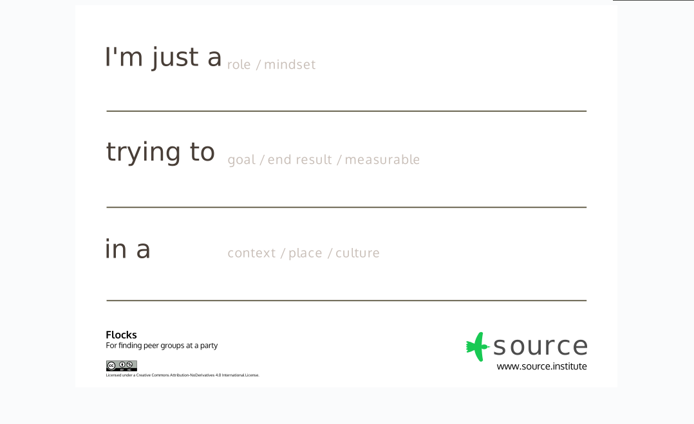

# Flocks
!!! quote "Birds of a feather flock together."

## Purpose
To allow people to find their peer-group in a large group

!!! top "Use When"
    Starting deeper relationships amongst a large number of attendees is desirable.

## Overview
A lot of people pushing the state of the art don’t feel like they’re succeeding.   Flocks aims to allow people to find each other based on commonalities in their personal struggles.  Since many people have part of the answer, just meeting each other allows them to connect their pieces – allowing more holistic and thorough solutions to form.

The format starts by stating this, and then inviting people to fill out a Flocks poster.  They quickly present it, and post it on a wall somewhere in the room, where they stay.  After the posters are created, people circulate the room like a tradeshow, gravitating to the posters that resonate with them and meeting like-minded people.

[Download the PDF here](/assets/downloads/Flocks_Poster.pdf)

!!! warning
    This poster may seem simple, but it has important helper text that are make-or-break for this format to work.

## Peer Learning Principles

Learners take responsibility of their learning journey.  Educators create environments that inspire and allow them to self-direct.
Create safe spaces so the learner can ask real questions and reveal true challenges.
Systematically create relationships to supply the most relevant sources of experience to the learning demand. Those may be authorities, or maybe those just a few steps ahead.

## Preparation

1. Print out large (A2 or A1) Flocks posters.  Print roughly 10-20% of the number of people who will be in the room.
2. Print out small (A4) Flocks posters.  Print roughly 20% of the number of people who will be in the room.
3. Keep the posters with felt-tip pens at the front of the room on a few large tables so multiple people can write their poster. (The small posters are for practice.)

## Process
| Time | Action | Tips |
| - | - | - |
| 2- 5 minutes | Intro talk.  Set the tone about what innovation feels like.  | Use examples of people in the room if you can.  If not, tell early-stage stories of big innovators before they were famous. |
| Allow 2-3 minutes for lining up and writing, then up to 15 minutes for presenting. | Poster Post-Up:  everyone lines up to make posters, and when they are ready they present them for 20 seconds.   | Try to only allow high-level clarifying questions and keep it moving fast.  People should use the “trade show” time for clarifying questions (not on stage). |
| Remainder (30-60 minutes) | Trade Show: people who wrote posters man their station.  The others walk around freely.  (Poster-makers can start walking around half-way through too.) |  Circulate the room like you’re hosting a party.  Make intros.  Encourage people with similar posters to hang them near each other. |

!!! tip
    At some point, if someone with a poster is alone, ask them to write their name and contact info on it, and let them walk around to mingle.

!!! info
    Flocks is great to do over a lunch break.  The setup draws everyone together, and the posters work great around an open cafeteria.

