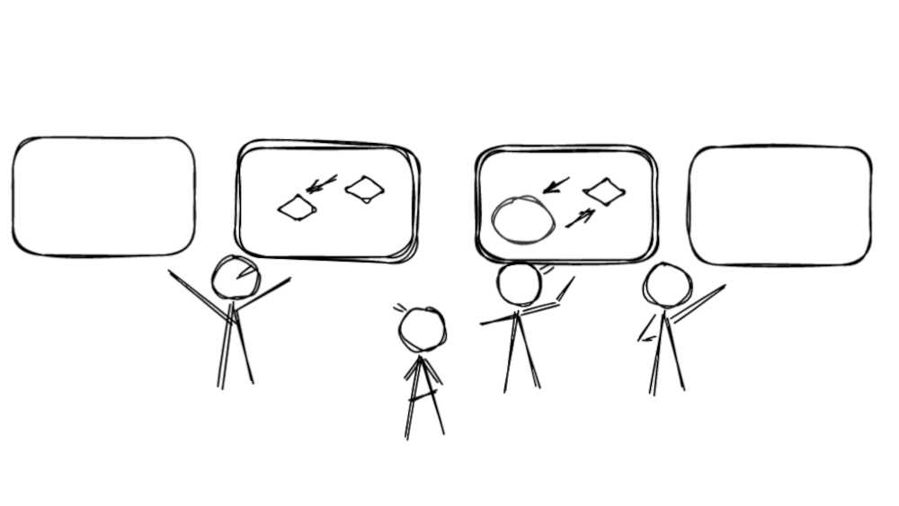

---
hide:
  - navigation
---

<h1>Sometimes, you need to go to the source.</h1>

Source Institute tokes a structural approach to peer learning, using it to build communities and surface emerging practices .  We treat peer learning as a robust discipline, and have demonstrated its superiority in some of the world's fastest-changing environments.

<a href="/start" title="" class="md-button md-button--primary"> Get started </a> 

<a href="/about/projects" title="" class="md-button"> See Our Work</a> 

