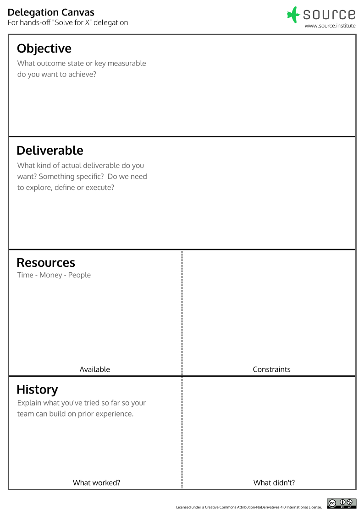

# Clinic

## Purpose
To learn practical skills from someone experienced.

!!! tip "Useful when"
    You want to transfer practical “in your hands”, practical skills or where setup and context are deeply relevant to the application of a learned skill.

## Overview
A Clinic session emulates an apprenticeship. A challenger, who has their own real challenge to solve, and an expert, who has some relevant experience in that area, will work together in a fixed timebox.  It starts with a description of the challenge and a bit of its history, and then moves to working on a specific artifact together.  The expert shows them by doing, but works in challengers context. By working on something tangible together, the challenger and the audience learn practical approaches. By working in the challengers context, the expert reacts to the challengers questions and guidance.

[Download the PDF](Delegation Canvas.pdf)

## Preparation
1. Print the following pages large enough for everyone in the room to see, either A3 or A2, and fix them to a wall that’s visible from both the stage and the audience.
2. Print a large Delegation Canvas (A1 or A0) and place it on stage.
3. Have sticky notes and felt pens on stage.
4. Select a challenger and an expert.

## Format

| Time | Action | Tips |
| - | - | - |
| 5- 8 minutes (or 20% of the total time, whichever is longer) | The faciltator works with the Challenger to complete a Delegation Canvas.  | Invite the Expert to ask questions and assess the situation.  Pay particular attention to what’s been tried – what worked and didn’t. Choose the Deliverable last. |
| 3 minutes | The Challenger chooses their deliverable.  (Could be an email, a dashboard, etc.) | |
| Remaining time | The Expert guides the Challenger on what to do and how to improve. Together they produce the deliverable. | Work with the Challengers equipment.  That way the Challengers context flushes up issues that The Expert should be aware of. (The expert may show their own setup for reference, but the Challenger leads. )|

